<picture>
  <source media="(prefers-reduced-motion: reduce)" srcset="assets/orbit-static.svg">
  
</picture>

### Full-Stack Engineer · GenAI · Cloud

I'm a full-stack developer comfortable across the whole software development process - frontend,
backend, cloud, and CI/CD. Alongside that I've built a strong understanding of AI systems and the
engineering behind them, shipping several **chatbots and RAG systems** at my current company.

These days I spend most of my time on **AI agents and orchestration, system design, AI engineering,
and backend systems**.

Full-Stack Developer at **YenDigital**.

---

📫 **sanskardixit81@gmail.com** · [LinkedIn](https://www.linkedin.com/in/sanskar-dixit-6699481a9)
